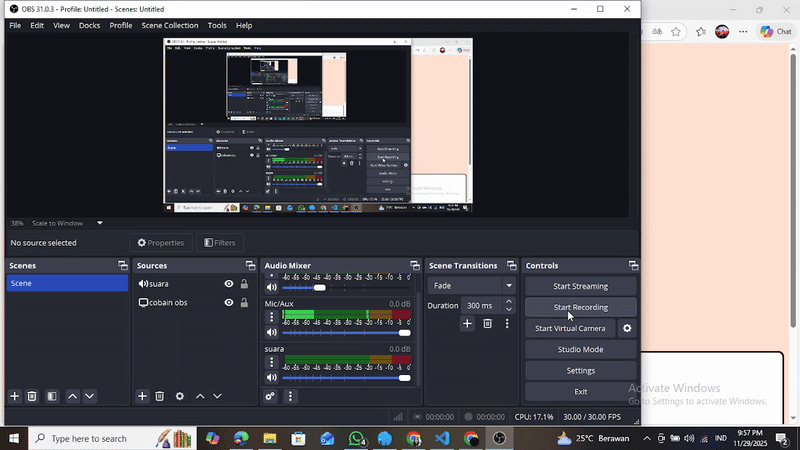

# Maharani Tri Wahyuningrum_H1H024012_ResponsiPBO25
Maharani Tri Wahyuningrum_H1H024012_ResponsiPBO25

## Data Diri
- Nama: Maharani Tri Wahyuningrum
- NIM : H1H024012
- Shift awal: A
- Shift awal: A
- Tanggal: 29 November 2025

## Deskripsi Singkat Website
Website "PokéCare — Pidgeotto" adalah simulasi berbasis PHP untuk mendemonstrasikan konsep OOP, diantaranya Encapsulation, Inheritance, Polymorphism, Abstraction. Simulasi ini diimplementasikan melalui latihan Pokémon Pidgeotto. 
Fitur :
- Halaman Beranda: menampilkan data awal Pokémon (nama, tipe, level, HP, EXP).
- Halaman Latihan: form training (jenis + intensitas), EXP, leveling, HP, skill unlock per level.
- Halaman Riwayat: menampilkan seluruh sesi latihan (jenis, intensitas, before/after, waktu).

## Video Project

